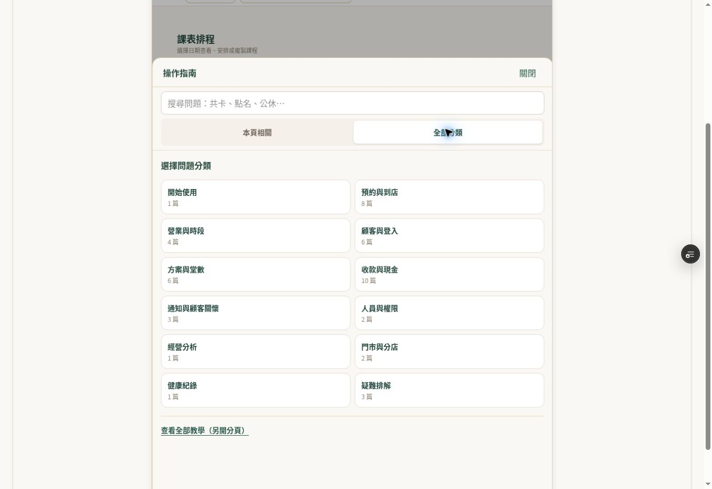
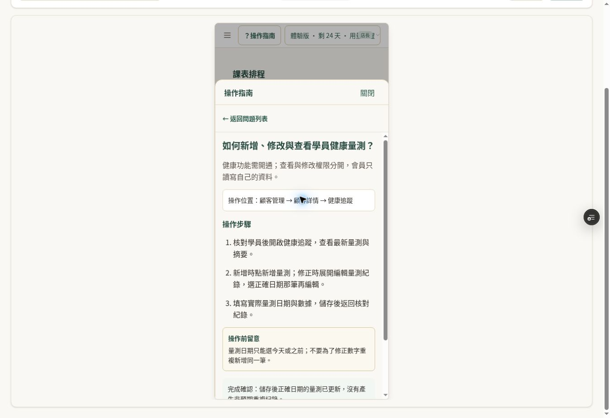

# 課程指南補強：登入後介面驗收

日期：2026-09-24。PR #1091，實測功能 commit `ee8decd93b7866ed0a528695f0fee9eafeb31e6c`。

## 測試失敗歸因

在獨立且未含本批指南的 main `5d519f0d1efa37bf68400f8b19daeabbd653b905` 執行三個失敗測試檔：14 項中 11 通過、3 失敗，與 PR CI 同樣重現。

| 測試 | 原因 |
| --- | --- |
| business-hours-store-scope | 模擬 loadDayBusinessHoursContext 缺 slotOverrides，執行 map 時失敗 |
| course-ui-final-fixes-contract | 測試仍要求舊 placeholder 原始碼，畫面已改用 CustomerInstantSearch |
| spa-shared-import-freeze | 實際相依 33 項，清單 32 項，多出 liff-consumption |

本批未引入上述失敗，但 CI 並未全數通過；沒有為過關修改營運規則、刪除測試或放寬斷言。

## 實際瀏覽器結果

透過安全登入介面登入既有測試店長，畫面顯示 staging 與「隔離新課程 A」。只閱讀指南與切換裝置預覽，沒有新增顧客、修改預約、扣點、收款或發送通知。店名與 staging 標記不當成資料庫隔離的獨立證據，因此本次沒有執行資料寫入。

- 頂欄唯一指南入口可開啟，首頁「本頁相關」顯示 C126 新手設定。
- 全部分類合計 47 篇：1／8／4／6／6／10／3／2／1／2／1／3，依畫面分類順序。
- 桌機搜尋「取消截止」找到 C126、C132，C132 可開啟並閱讀步驟。
- 裝置預覽的平板 768 × 1024 可開啟指南與全部分類，綠金外觀及兩欄分類正常。
- 手機尺寸預覽可搜尋「量測」找到 C135，開啟文章、捲動、展開詳細說明與返回成功；返回後仍保留搜尋結果。
- 手機與平板為瀏覽器內建裝置尺寸預覽，不是 iPhone／iPad 實機，也未測虛擬鍵盤。

## 驗收界線及待辦

指南介面上述項目通過；整體逐篇操作驗收仍未完成。未使用另一個受限權限帳號實測隱藏文章；權限篩選目前只有程式測試證據。沒有逐篇執行新增、修改、儲存等營運流程，因此不減少原本 64 篇待操作驗收清單，不將文章標成完整互動驗收通過。

PR 維持草稿，未合併正式站。剩餘：受限權限帳號驗收、逐篇業務操作驗收與既有 CI 失敗處理。
