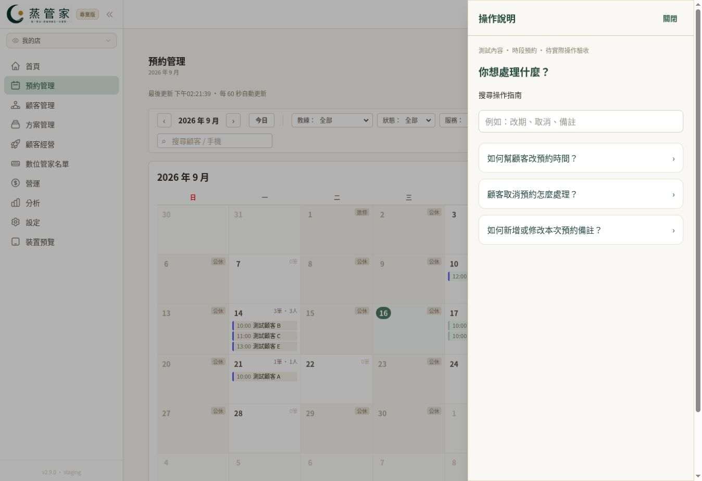
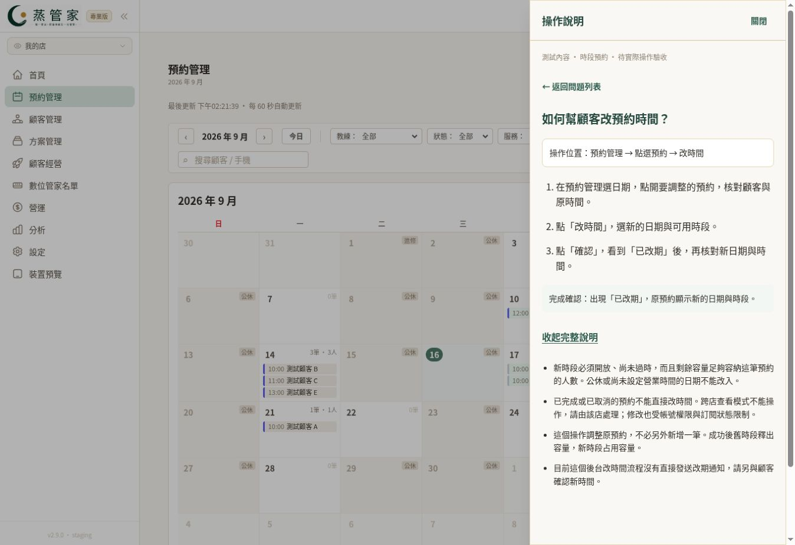
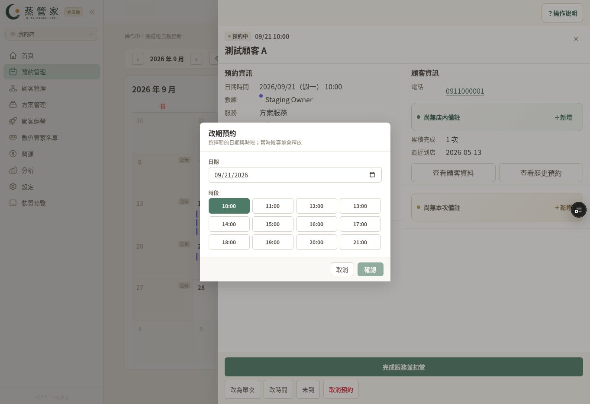

# 操作指南首三題：規則核對與驗收紀錄

日期：2026-09-16。依據：main 44c1f1f0。只限時段模組，不套用到 SPA／課程。

## 交付與界線

已新增 A01／A02／A03 共用內容與預約管理頁「？操作說明」，預約詳情內也提供相同入口，以便編輯備註時查看。包含搜尋、問題列表、三步驟、完成確認、完整注意事項。桌機右側面板、手機底部抽屜，使用原生 dialog 保留原頁元件。Escape 在教學面板內停止傳播，避免連帶關閉預約詳情。

只在 VERCEL_ENV=preview 開啟；本機開發可設定 OPERATION_GUIDE_PREVIEW=true。正式環境不顯示。未修改 server actions、資料模型、預約／扣堂／通知規則。這輪尚未新增全站指南頁或擴充其餘 12 題。

## 規則證據

| 題目 | 已核對的實作 | 教學重點 |
|---|---|---|
| A01 改時間 | bookings/booking-detail-drawer.tsx 的 handleReschedule、ActionFooter；reschedule-modal.tsx；server/actions/booking.ts 的 updateBooking | 開放日期、時段、容量；已完成／取消不能直接修改；成功顯示已改期；此 action 無直接改期通知呼叫 |
| A02 取消預約 | booking-detail-drawer.tsx 的 handleCancel；server/actions/booking.ts 的 cancelBooking | 原生確認框；釋放 RESERVED 堂數與補課券；不自動退費；顧客端 12 小時限制不寫成後台限制；此 action 無直接取消通知呼叫 |
| A03 本次預約備註 | booking-note-editor.tsx；server/actions/booking-note.ts；server/actions/booking-drawer.ts 的 canEditBookingNote | 實際欄名「本次備註」；500 字；清空可移除；需要 booking.update；完成後可改；不改狀態或結帳 |

完整來源均在 src/app/(dashboard)/dashboard/bookings 或 src/server/actions。文章來源在 src/lib/operation-guide.ts。

## 待實際驗收與截圖（不能標成通過）

- 使用者已明確授權提交至 rock7652-beep/steamfoot-booking。Git CLI 缺少登入憑證，改用已連接 GitHub 外掛提交相同檔案；草稿 PR #1036 已建立，尚未合併。

- 已透過安全登入進入 Steamfoot Staging / 測試店。僅核對畫面與教學互動；沒有提交改期、取消或備註儲存。資料寫入與權限驗收仍待完成。
- 375px、390px、1440px：開啟、搜尋、三題切換、完整說明、關閉、Escape、焦點回復、捲動及背景不誤操作。
- 編輯中的本次備註：開關說明後內容與原畫面位置不遺失。
- A01 實際截圖：預約詳情與「改時間」位置、改期日期／時段選擇、成功後新時間。
- A02 實際截圖：取消入口與確認框、已取消狀態；另核对測試堂數／補課券及既有收款未被改動。
- A03 實際截圖：新增／編輯入口、輸入與儲存、重新開啟後內容；涵蓋清空與儲存失敗。
- 唯讀跨店、一般員工／無 booking.update、訂閱不可寫時，指南不能解鎖操作。
- 截圖只使用測試姓名與資料；不得將模擬截圖標為實際後台證據。

## 核對時發現的既有差異

cancelBooking 使用 requireSession + assertStaffBookingWritable + assertStoreAccess，沒有與 updateBooking 相同的 requireWritablePermission("booking.update")。因此教學沒有宣稱兩者權限檢查完全一致；員工取消權限需另外實測與評估。本次不改既有權限行為。

## 擴充門檻

首三題實際畫面、隔離操作與權限驗收通過後，再接 A04–A10、B04、B05、B10、D03、D05，累計 15 題。未驗收前維持草稿，不合併正式站。

## 本機檢查

- operation-guide、booking-note、booking-note-state、booking-reschedule-ui-wiring：4 檔、18 項通過。
- 修改檔案 ESLint 通過；完整 TypeScript noEmit 檢查通過。
- 新增互動測試涵蓋同義詞搜尋、文章返回、展開取消後果、關閉保留原頁草稿、重新開啟回到列表、Escape 不傳給底下抽屜。
- jsdom 模擬 dialog 開關只驗 React 狀態，不能代替瀏覽器原生焦點、手機排版或實際資料寫入驗收。
- Prisma client 在本機產生，沒有執行 migrate、seed 或連線修改資料庫。

## Preview 與實際畫面（2026-09-16）

### 第二輪優化（待新版瀏覽器驗收）

- 縮短為「更改預約時間」「取消預約」「新增／修改本次備註」。
- 重要提醒直接顯示在三步驟下方，取消不等於退費不再藏在收合內容中。
- 集中式 /dashboard/guide 與當頁面板共用 OperationGuideContent；預覽環境的時段模組選單加入「操作指南」，沿用 booking.read 檢查。SPA 不提供未核實的時段教學；正式環境入口與頁面皆關閉。
- 當頁面板可另開完整指南，保留目前操作頁面與未送出內容。
- 改期文章嵌入先前取得的實際測試截圖，用畫面上的 ①日期、②時段、③確認標記對應操作，可點圖放大。標記是前端覆蓋，原始截圖不變。
- 重試瀏覽器連線與 Escape 恢復均逾時，未改用其他方式繞過。下列截圖是第一輪版本，不能視為新版已驗收。

- 草稿 PR：https://github.com/rock7652-beep/steamfoot-booking/pull/1036
- 受測提交：2cbe8cd8971ee5a87126204231761ee6958d4b86。Vercel dpl_68NHxu8gkrMYQdfRhFXyYWhVekt5 部署成功。
- GitHub CI 35062769198 成功；Booking isolated database audit 為 skipped，不能當成通過。
- 已實際點選：預約管理頁說明入口、問題列表、搜尋「改期」、開啟 A01、展開完整說明、關閉、打開測試顧客 A 的詳情、打開「改時間」。核對日期與可用時段呈現。
- 桌機實際視窗為 1363 × 936；尚未驗收 1440px。既有「裝置預覽」以 390 × 844 iframe 開啟教學列表；尚未完成手機截圖，未驗收 375px。
- 擷取手機 fullPage 截圖時瀏覽器逾時；後續取消按鈕 click 與 CDP refresh 也逾時，不能判定確認框完整驗收通過。沒有呼叫確認取消的 accept。
- 待補：A02／A03 完整截圖、備註草稿保留實測、Escape／焦點回復、手機視覺、隔離寫入及不同權限驗收。未達首三題全數通過門檻，暫不擴充其餘 12 題。

### 實際截圖

