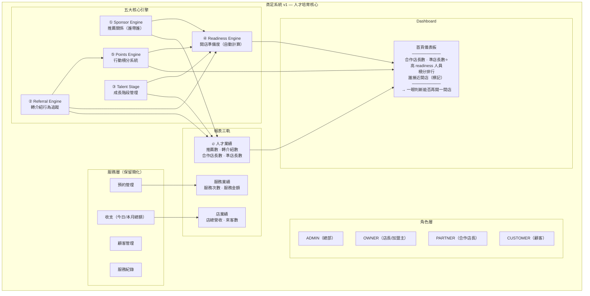
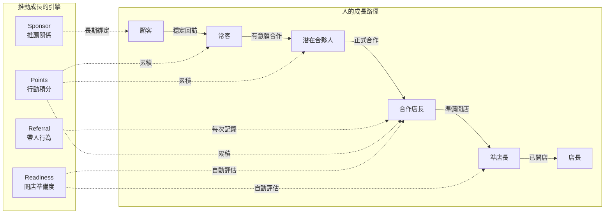
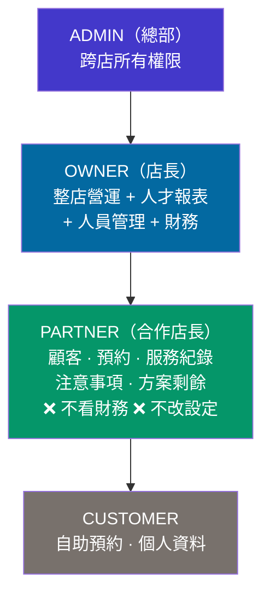

# 蒸足系統 v1 重整計畫

> 產出日期：2026-04-13
> 核心定位：**人才培育與開店複製系統**
> 核心問題：「誰是下一個會開店的人？」

---

## 一、系統架構圖



### 資料流架構



### 權限架構



---

## 二、MVP 功能清單

### 🟢 保留（核心功能）

| # | 功能 | 說明 | 變更 |
|---|------|------|------|
| 1 | 預約管理 | 時段預約 + 日曆 + 報到 | 不動 |
| 2 | 顧客管理 | CRUD + 詳情頁 | 加入 Referral/Points 區塊 |
| 3 | 服務紀錄 | Booking COMPLETED 即為紀錄 | 不動 |
| 4 | Sponsor 推薦關係 | Customer.sponsorId | ✅ 已有，不動 |
| 5 | Talent Stage 成長階段 | 6 階段 + StageLog | ✅ 已有，不動 |
| 6 | Readiness 開店準備度 | 自動計算 0-100 | 改用 Points 作為權重因子 |

### 🆕 新增（本次重點）

| # | 功能 | 說明 | 優先度 |
|---|------|------|--------|
| 7 | **Referral 轉介紹** | 獨立追蹤每次帶人行為 | P0 |
| 8 | **Points 行動積分** | 行為給分（帶人 / 參與 / 成長） | P0 |
| 9 | **人才業績報表** | 推薦數、轉介紹數、合作店長數、準店長數 | P0 |
| 10 | **人才 Dashboard** | 首頁整合人才核心指標 | P0 |

### 🟡 簡化

| # | 功能 | 原狀 | 簡化方向 |
|---|------|------|----------|
| 11 | 報表 | 營收明細 + Coach 分潤 | 改為人數導向三軌報表 |
| 12 | 收支 | Transaction 完整明細 | 只留今日/本月總額 |
| 13 | 角色 | ADMIN / STORE_MANAGER / COACH / CUSTOMER | 重命名為 ADMIN / OWNER / PARTNER / CUSTOMER |

### 🔴 移除 / 不做

| # | 功能 | 理由 |
|---|------|------|
| — | 抽成系統 / 分潤機制 | 不符合商業模式（系統月費制） |
| — | Coach Revenue 報表 | 合併至人才業績 |
| — | Space Fee 空間租費 | 移除 |
| — | 複雜財務報表 | 簡化為總額 |
| — | KPI 分析 | 用 Points + Readiness 取代 |
| — | 進銷存 | 不做 |
| — | 多層加盟制度 | 不做 |

---

## 三、Schema 變更

### 3.1 角色重命名

```prisma
// 舊
enum UserRole {
  ADMIN
  STORE_MANAGER  // ← 刪除
  COACH          // ← 刪除
  CUSTOMER
}

// 新
enum UserRole {
  ADMIN
  OWNER          // 原 STORE_MANAGER
  PARTNER        // 原 COACH
  CUSTOMER
}
```

> ⚠️ 需要 DB migration + 全程式碼搜尋替換
> `STORE_MANAGER` → `OWNER`（約 120+ 處）
> `COACH` → `PARTNER`（約 80+ 處）

### 3.2 新增 Referral Model

```prisma
enum ReferralStatus {
  PENDING      // 已登記，尚未到店
  VISITED      // 已到店
  CONVERTED    // 已成為顧客
  CANCELLED    // 取消/無效
}

model Referral {
  id                  String         @id @default(cuid())
  storeId             String
  referrerId          String         // 誰介紹的（Customer.id）
  referredName        String         // 被介紹人姓名
  referredPhone       String?        // 被介紹人電話
  status              ReferralStatus @default(PENDING)
  convertedCustomerId String?        // 轉為顧客後連接
  note                String?
  createdAt           DateTime       @default(now())
  updatedAt           DateTime       @updatedAt

  store              Store     @relation(fields: [storeId], references: [id])
  referrer           Customer  @relation("ReferralsMade", fields: [referrerId], references: [id])
  convertedCustomer  Customer? @relation("ReferralConverted", fields: [convertedCustomerId], references: [id])

  @@index([storeId])
  @@index([referrerId])
  @@index([status])
}
```

### 3.3 新增 Points Model

```prisma
enum PointType {
  // 帶人（最重要）
  REFERRAL_CREATED     // 轉介紹 → +10
  REFERRAL_VISITED     // 成功到店 → +20
  REFERRAL_CONVERTED   // 成為顧客 → +30
  REFERRAL_PARTNER     // 成為合作店長 → +100

  // 參與
  ATTENDANCE           // 出席 → +5
  SERVICE              // 服務 → +5
  SERVICE_NOTE         // 填寫服務紀錄 → +3

  // 成長
  BECAME_PARTNER       // 成為合作店長 → +100
  BECAME_FUTURE_OWNER  // 成為準店長 → +200

  // 手動調整
  MANUAL_ADJUSTMENT    // 管理員手動調整
}

model PointRecord {
  id        String    @id @default(cuid())
  userId    String    // 對應 Customer.id（積分對象）
  storeId   String
  type      PointType
  points    Int       // 正數=加分，負數=扣分
  note      String?
  createdAt DateTime  @default(now())

  customer  Customer  @relation(fields: [userId], references: [id])
  store     Store     @relation(fields: [storeId], references: [id])

  @@index([userId])
  @@index([storeId])
  @@index([createdAt])
}
```

### 3.4 Customer Model 新增欄位

```prisma
model Customer {
  // ... 現有欄位 ...

  // 🆕 積分（快取，避免每次 SUM）
  totalPoints     Int     @default(0)

  // 🆕 Relations
  referralsMade       Referral[] @relation("ReferralsMade")
  referralsConverted  Referral[] @relation("ReferralConverted")
  pointRecords        PointRecord[]
}
```

### 3.5 Store Model 新增 Relations

```prisma
model Store {
  // ... 現有欄位 ...

  // 🆕 Relations
  referrals      Referral[]
  pointRecords   PointRecord[]
}
```

### 3.6 Readiness 計算公式更新

```typescript
// 舊版：referralCount * 5 + attendance / 2 + attendanceRate * 25 + daysInStage / 12
// 新版：加入 Points 權重，移除 daysInStage（積分已隱含時間因素）

interface ReadinessMetrics {
  referralCount: number;      // 推薦人數
  referralScore: number;      // 0-25
  attendanceCount: number;    // 出席次數
  attendanceScore: number;    // 0-25
  attendanceRate: number;     // 出席率
  attendanceRateScore: number; // 0-25
  totalPoints: number;        // 行動積分
  pointsScore: number;        // 0-25（取代 daysInStage）
}

// pointsScore 計算：
// totalPoints / 20，上限 25
// 即 500 分即滿分
```

### 3.7 移除欄位（簡化）

```prisma
// Staff model：
//   移除 monthlySpaceFee
//   移除 spaceFeeEnabled

// 移除 model SpaceFeeRecord（整個刪除）

// DutyRole enum：簡化
enum DutyRole {
  OWNER
  PARTNER
}
```

### 3.8 完整 Migration 順序

```
1. 新增 ReferralStatus enum
2. 新增 PointType enum
3. 新增 Referral model
4. 新增 PointRecord model
5. Customer 加 totalPoints 欄位
6. Customer 加 Referral relations
7. UserRole enum 重命名值（STORE_MANAGER → OWNER, COACH → PARTNER）
8. DutyRole enum 簡化
9. Staff 移除 spaceFee 相關欄位
10. 移除 SpaceFeeRecord model
```

---

## 四、Dashboard 設計

### 4.1 首頁 Dashboard（重新設計）

```
┌─────────────────────────────────────────────┐
│  歡迎回來，[店長名]     今天 4月13日（一）  │
│                                     [忙碌度] │
└─────────────────────────────────────────────┘

┌──────── 🔥 人才核心指標（最顯眼位置）────────┐
│                                               │
│  ┌───────┐ ┌───────┐ ┌───────┐ ┌───────┐    │
│  │合作店長│ │準店長⭐│ │ HIGH+ │ │本月轉介│   │
│  │  3 位  │ │ 1 位  │ │ 2 位  │ │  8 次  │   │
│  └───────┘ └───────┘ └───────┘ └───────┘    │
│                                               │
│  📍 接近開店：王小明（READY · 92分 · 356積分）│
│  📍 接近開店：李大華（HIGH · 78分 · 280積分） │
│                                               │
│  → 一眼判斷：這間店能不能再開一間店            │
└───────────────────────────────────────────────┘

┌──────── 積分排行 TOP 5 ─────────────────────┐
│  1. 王小明   356 分  ▲ +45 本月             │
│  2. 李大華   280 分  ▲ +30 本月             │
│  3. 陳美玲   195 分  ▲ +25 本月             │
│  4. 張志偉   142 分  ▲ +15 本月             │
│  5. 林淑芬   120 分  ▲ +10 本月             │
└──────────────────────────────────────────────┘

┌──────── 人才漏斗 ────────────────────────────┐
│  顧客 42 → 常客 18 → 潛在 8 → 合作 3 → 準1  │
│  ████████████████  ████████  ████  ██  █     │
└──────────────────────────────────────────────┘

┌──────── 今日營運（簡化版）───────────────────┐
│  ┌───────┐ ┌───────┐ ┌───────┐              │
│  │今日預約│ │今日營收│ │本月營收│              │
│  │  8 筆  │ │$3,200 │ │$42,000│              │
│  └───────┘ └───────┘ └───────┘              │
└──────────────────────────────────────────────┘

┌──────── 今日預約列表 ────────────────────────┐
│  10:00  王小明  3人  [已確認]                │
│  11:00  李大華  2人  [待確認]                │
│  14:00  新客·張三（王小明轉介） [體驗]       │
│  ...                                         │
└──────────────────────────────────────────────┘
```

### 4.2 人才報表頁（三軌）

```
┌─ Tab: 服務業績 | 店業績 | 🔥人才業績 ────────┐
│                                               │
│ [人才業績 Tab - 預設選中]                      │
│                                               │
│  本月人才業績                                  │
│  ┌───────┐ ┌───────┐ ┌───────┐ ┌───────┐    │
│  │推薦人數│ │轉介紹數│ │新合作  │ │新準店長│   │
│  │  12人  │ │  8次  │ │  1位  │ │  0位  │    │
│  └───────┘ └───────┘ └───────┘ └───────┘    │
│                                               │
│  轉介紹追蹤（本月）                            │
│  ┌────────────────────────────────────────┐  │
│  │ 介紹人    被介紹    狀態      日期      │  │
│  │ 王小明    張三      ✅已到店  4/10     │  │
│  │ 王小明    李四      ⏳待確認  4/12     │  │
│  │ 李大華    趙六      ✅已轉顧客 4/08    │  │
│  └────────────────────────────────────────┘  │
│                                               │
│  成長事件                                      │
│  • 4/10 陳美玲 常客→潛在合夥人（+積分 trigger）│
│  • 4/05 李大華 升為合作店長（+100積分）        │
└───────────────────────────────────────────────┘
```

### 4.3 顧客詳情頁（增強）

```
┌─ 顧客：王小明 ──────────────────────────────┐
│  階段：合作店長  │  積分：356  │  Readiness: HIGH (78) │
│                                               │
│  推薦人：林店長                                │
│  推薦了：張三、李四、陳五 （共 3 人）          │
│                                               │
│  ┌─ 轉介紹紀錄 ────────────────────────────┐ │
│  │ 張三  → 已到店   4/10  (+20分)          │ │
│  │ 李四  → 待確認   4/12  (+10分)          │ │
│  │ 趙七  → 已轉顧客 3/28  (+30分)         │ │
│  └──────────────────────────────────────────┘ │
│                                               │
│  ┌─ 積分紀錄 ──────────────────────────────┐ │
│  │ 4/12  轉介紹     +10                    │ │
│  │ 4/10  到店成功   +20                    │ │
│  │ 4/08  出席       +5                     │ │
│  │ 4/05  服務       +5                     │ │
│  │ ...                                      │ │
│  │ 合計：356 分                             │ │
│  └──────────────────────────────────────────┘ │
│                                               │
│  ┌─ 預約紀錄（現有）──────────────────────┐  │
│  └──────────────────────────────────────────┘ │
└───────────────────────────────────────────────┘
```

### 4.4 PARTNER 視角（簡化版 Dashboard）

```
┌─────────────────────────────────────────────┐
│  歡迎回來，[合作店長名]                      │
└─────────────────────────────────────────────┘

┌──────── 我的指標 ────────────────────────────┐
│  ┌───────┐ ┌───────┐ ┌───────┐              │
│  │我的積分│ │我的轉介│ │我的顧客│              │
│  │ 280分  │ │  5次  │ │  12位 │              │
│  └───────┘ └───────┘ └───────┘              │
└──────────────────────────────────────────────┘

┌──────── 今日預約 ────────────────────────────┐
│  （共享查看，可服務所有顧客）                  │
└──────────────────────────────────────────────┘

┌──────── 顧客列表 ────────────────────────────┐
│  （可查看：資料 · 預約 · 服務紀錄 · 方案剩餘）│
│  （❌ 不可看：財務 · 設定 · 人員管理）          │
└──────────────────────────────────────────────┘
```

---

## 五、Code 可執行任務拆解

### Phase 0：準備工作（1 天）

| # | 任務 | 檔案 | 工時 |
|---|------|------|------|
| 0.1 | 建立 feature branch `feat/v1-talent-core` | — | 5m |
| 0.2 | 備份現有 schema | `prisma/schema.prisma` | 5m |
| 0.3 | 更新設計文件 | `docs/` | 30m |

### Phase 1：Schema Migration（2 天）

| # | 任務 | 檔案 | 依賴 |
|---|------|------|------|
| 1.1 | 新增 `ReferralStatus` enum | `schema.prisma` | — |
| 1.2 | 新增 `PointType` enum | `schema.prisma` | — |
| 1.3 | 新增 `Referral` model | `schema.prisma` | 1.1 |
| 1.4 | 新增 `PointRecord` model | `schema.prisma` | 1.2 |
| 1.5 | Customer 加 `totalPoints` + relations | `schema.prisma` | 1.3, 1.4 |
| 1.6 | Store 加 relations | `schema.prisma` | 1.3, 1.4 |
| 1.7 | 執行 `prisma migrate dev` 驗證 | — | 1.1-1.6 |
| 1.8 | UserRole rename migration（手寫 SQL） | `migration.sql` | 1.7 |
| 1.9 | 移除 SpaceFee 相關欄位/model | `schema.prisma` | 1.8 |
| 1.10 | 執行完整 migration + seed 更新 | `seed.ts` | 1.9 |

### Phase 2：角色重命名（全域替換）（2 天）

| # | 任務 | 範圍 | 依賴 |
|---|------|------|------|
| 2.1 | `STORE_MANAGER` → `OWNER` 全域替換 | `src/**/*.ts`, `src/**/*.tsx` | 1.8 |
| 2.2 | `COACH` → `PARTNER` 全域替換 | `src/**/*.ts`, `src/**/*.tsx` | 1.8 |
| 2.3 | 更新 `permissions.ts` 角色常數 | `src/lib/permissions.ts` | 2.1, 2.2 |
| 2.4 | 更新 `ROLE_LABELS` | `src/lib/permissions.ts` | 2.3 |
| 2.5 | 更新 PARTNER 預設權限（加 talent.read） | `src/lib/permissions.ts` | 2.3 |
| 2.6 | 更新 `role-permission-matrix.md` | `docs/` | 2.3 |
| 2.7 | 全域 build 驗證（`next build`） | — | 2.1-2.6 |

### Phase 3：Referral 功能（3 天）

| # | 任務 | 檔案 | 依賴 |
|---|------|------|------|
| 3.1 | Referral Zod validator | `src/lib/validators/referral.ts` | 1.7 |
| 3.2 | Referral types | `src/types/referral.ts` | 1.7 |
| 3.3 | `createReferral` server action | `src/server/actions/referral.ts` | 3.1 |
| 3.4 | `updateReferralStatus` server action | `src/server/actions/referral.ts` | 3.1 |
| 3.5 | `convertReferral` action（連接 Customer） | `src/server/actions/referral.ts` | 3.3 |
| 3.6 | `getReferralsByStore` query | `src/server/queries/referral.ts` | 3.2 |
| 3.7 | `getReferralsByReferrer` query | `src/server/queries/referral.ts` | 3.2 |
| 3.8 | 顧客詳情頁 — 轉介紹區塊 UI | `src/app/(dashboard)/dashboard/customers/[id]/referral-section.tsx` | 3.6 |
| 3.9 | 新增轉介紹表單 dialog | `src/components/referral-form.tsx` | 3.3 |
| 3.10 | 轉介紹管理列表頁 | `src/app/(dashboard)/dashboard/referrals/page.tsx` | 3.6 |

### Phase 4：Points 積分功能（3 天）

| # | 任務 | 檔案 | 依賴 |
|---|------|------|------|
| 4.1 | Points types | `src/types/points.ts` | 1.7 |
| 4.2 | Points 配分常數 | `src/lib/points-config.ts` | — |
| 4.3 | `awardPoints` server action（核心） | `src/server/actions/points.ts` | 4.1, 4.2 |
| 4.4 | `getPointHistory` query | `src/server/queries/points.ts` | 4.1 |
| 4.5 | `getPointsLeaderboard` query | `src/server/queries/points.ts` | 4.1 |
| 4.6 | 自動給分 hook：Referral 狀態變更 → 觸發 | `src/server/actions/referral.ts` 修改 | 3.4, 4.3 |
| 4.7 | 自動給分 hook：Booking COMPLETED → 觸發 | `src/server/actions/booking.ts` 修改 | 4.3 |
| 4.8 | 自動給分 hook：TalentStage 變更 → 觸發 | `src/server/actions/talent.ts` 修改 | 4.3 |
| 4.9 | 顧客詳情頁 — 積分區塊 UI | `src/app/(dashboard)/dashboard/customers/[id]/points-section.tsx` | 4.4 |
| 4.10 | 手動調整積分 dialog（OWNER only） | `src/components/manual-points-form.tsx` | 4.3 |

### Phase 5：Readiness 升級（1 天）

| # | 任務 | 檔案 | 依賴 |
|---|------|------|------|
| 5.1 | 更新 `ReadinessMetrics` type | `src/types/talent.ts` | 4.1 |
| 5.2 | 更新 `computeReadinessScores`（加入 Points） | `src/server/queries/talent.ts` | 4.5, 5.1 |
| 5.3 | 更新人才 Dashboard 顯示 | `src/app/(dashboard)/dashboard/talent/page.tsx` | 5.2 |

### Phase 6：Dashboard 重設計（3 天）

| # | 任務 | 檔案 | 依賴 |
|---|------|------|------|
| 6.1 | 首頁 — 人才核心指標區塊 | `src/app/(dashboard)/dashboard/page.tsx` | 3.6, 4.5, 5.2 |
| 6.2 | 首頁 — 積分排行區塊 | `src/app/(dashboard)/dashboard/points-leaderboard.tsx` | 4.5 |
| 6.3 | 首頁 — 人才漏斗區塊 | `src/app/(dashboard)/dashboard/talent-funnel.tsx` | Phase 3 |
| 6.4 | 首頁 — 簡化營運 KPI（移到下方） | `src/app/(dashboard)/dashboard/page.tsx` 修改 | — |
| 6.5 | 首頁 — 今日預約增加轉介紹標記 | `src/app/(dashboard)/dashboard/today-bookings-list.tsx` 修改 | 3.6 |
| 6.6 | PARTNER 視角首頁 | `src/app/(dashboard)/dashboard/page.tsx` 條件渲染 | 2.2 |
| 6.7 | Sidebar 選單調整（加 Referrals, 簡化報表） | `src/components/sidebar.tsx` | — |

### Phase 7：報表三軌（2 天）

| # | 任務 | 檔案 | 依賴 |
|---|------|------|------|
| 7.1 | 報表頁 Tab 架構（服務 / 店 / 人才） | `src/app/(dashboard)/dashboard/reports/page.tsx` | — |
| 7.2 | 服務業績 tab（服務次數、金額） | `src/server/queries/report-service.ts` | — |
| 7.3 | 店業績 tab（總營收、來客數） | `src/server/queries/report-store.ts` | — |
| 7.4 | 🔥 人才業績 tab（推薦數、轉介紹、合作店長、準店長） | `src/server/queries/report-talent.ts` | 3.6, 4.5 |
| 7.5 | 移除 coach-revenue 頁面 | 刪除 `src/app/(dashboard)/dashboard/coach-revenue/` | — |
| 7.6 | 移除 store-revenue 頁面（合併至報表） | 刪除 `src/app/(dashboard)/dashboard/store-revenue/` | — |

### Phase 8：權限更新 + 清理（1 天）

| # | 任務 | 檔案 | 依賴 |
|---|------|------|------|
| 8.1 | PARTNER 權限矩陣實作 | `src/lib/permissions.ts` | 2.3 |
| 8.2 | 新增 `referral.read`, `referral.manage` 權限碼 | `src/lib/permissions.ts` | — |
| 8.3 | 新增 `points.read`, `points.manage` 權限碼 | `src/lib/permissions.ts` | — |
| 8.4 | 移除 SpaceFee 相關 code | 搜尋 `spaceFee` / `SpaceFee` | 1.9 |
| 8.5 | 移除 coach-revenue API routes | `src/app/api/reports/coach-revenue/` | 7.5 |
| 8.6 | 更新 seed 資料 | `prisma/seed.ts` | all |

### Phase 9：測試 + 驗證（2 天）

| # | 任務 | 說明 | 依賴 |
|---|------|------|------|
| 9.1 | `next build` 全量編譯通過 | 無 TS error | all |
| 9.2 | Prisma migrate 乾淨執行 | 無 schema drift | Phase 1 |
| 9.3 | 手動測試：建立 Referral 流程 | UI → DB | Phase 3 |
| 9.4 | 手動測試：自動積分觸發 | Referral + Booking + Stage | Phase 4 |
| 9.5 | 手動測試：Readiness 含 Points | 分數正確 | Phase 5 |
| 9.6 | 手動測試：PARTNER 視角權限 | 不能看財務 | Phase 8 |
| 9.7 | 手動測試：Dashboard 各區塊 | 資料正確呈現 | Phase 6 |

---

## 總工時估算

| Phase | 說明 | 預估工時 |
|-------|------|---------|
| 0 | 準備 | 1 天 |
| 1 | Schema Migration | 2 天 |
| 2 | 角色重命名 | 2 天 |
| 3 | Referral 功能 | 3 天 |
| 4 | Points 積分 | 3 天 |
| 5 | Readiness 升級 | 1 天 |
| 6 | Dashboard 重設計 | 3 天 |
| 7 | 報表三軌 | 2 天 |
| 8 | 權限 + 清理 | 1 天 |
| 9 | 測試驗證 | 2 天 |
| **合計** | | **~20 天** |

> 建議依序 Phase 1 → 2 → 3 → 4 → 5 → 6 → 7 → 8 → 9
> Phase 3 和 4 可部分並行（schema 完成後）

---

## 風險與注意事項

1. **角色重命名是最大風險**：`STORE_MANAGER` / `COACH` 散布在 120+ 檔案中，需要仔細的全域搜尋替換 + DB migration SQL
2. **Points 快取一致性**：`Customer.totalPoints` 是快取欄位，需確保每次 `awardPoints` 都同步更新
3. **現有資料遷移**：已有的 `sponsorId` 資料不需變動；現有 Staff 的 role 需要 SQL UPDATE
4. **向下相容**：移除 SpaceFee 前需確認無其他模組依賴
5. **PARTNER 權限收窄**：現有 COACH 能做的事比新的 PARTNER 多，需通知現有使用者
